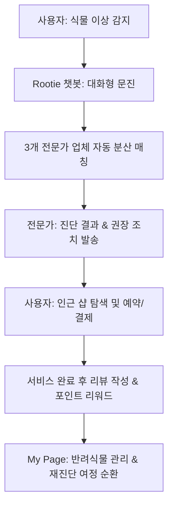

# Rootie 제품 요구사항 정의서 (PRD)

본 문서는 Figma 신규 디자인 파일(Node `124:906`)에 구현된 서비스 핵심 화면들과 전체 흐름을 기반으로 새롭게 전면 개편된 **Rootie (루티)** 플랫폼의 제품 요구사항 정의서(PRD)입니다.

---

## 1. 제품 개요 (Product Overview)

### 1.1 제품 소개
**Rootie**는 반려식물 집사들이 겪는 건강 관리의 어려움을 비대면 챗봇 문진, 위치 기반 전문가 매칭, 그리고 사후 관리까지 매끄럽게 연결해 주는 **올인원 반려식물 헬스케어 및 로컬 서비스 매칭 플랫폼**입니다.

### 1.2 서비스 비전
> "어려운 식물 관리를 친근한 대화형 진단과 동네 전문가 매칭을 통해 쉽고 즐거운 일상으로 변화시킵니다."



---

## 2. 제품 핵심 여정 (Core User Journey)

### 2.1 여정 1: 대화형 문진 및 전문가 매칭 (비대면 진단 Flow)
* **챗봇과의 대화**: 사용자가 반려식물의 상태에 대해 챗봇과 대화하며 식물 종류, 증상, 급수 주기, 일조량, 증상 기간을 선택형 및 텍스트형으로 답변합니다.
* **문진표 요약 및 전송**: 수집된 답변은 일목요연한 '문진 요약 카드'로 정리되며, 사용자가 확인 후 '이 내용으로 전문가에게 전달해줘' 버튼을 눌러 인근 3개 전문가 업체에 자동 발송합니다.
* **진단서 수령**: 대기 중인 전문가가 상태를 진단하여 과습 의심, 추천 행동 요령 등이 포함된 전문 진단 카드를 전송합니다.

### 2.2 여정 2: 지도 기반 인근 샵 탐색 및 정보 조회
* **위치 설정**: 사용자의 동네 위치(상세 주소 제외)를 기반으로 지도 상에 전문가 및 전문 케어 샵을 배치합니다.
* **샵 상세 탐색**: 각 샵의 정보(영업시간, 서비스 유형, 분갈이/영양제/가지치기 가격표, 실사용자 평점 및 포토 후기)를 투명하게 제공하여 의사결정을 돕습니다.

### 2.3 여정 3: 예약 및 Rootie Pay 결제
* **예약 신청**: 홈/진단 탭 또는 상세 페이지에서 즉시 날짜와 서비스를 선택하여 방문/출장 케어를 예약합니다.
* **편리한 결제**: 충전 및 송금이 가능한 'Rootie Pay' 잔액을 사용해 결제를 완료하고 실시간으로 예약을 확정합니다.

### 2.4 여정 4: 사후 관리 및 반려식물 아카이빙
* **이력 관리**: 케어 이력과 진단 내역은 '내 반려식물' 탭에 아카이빙되며 지속적인 케어 알림을 받습니다.
* **경험 공유**: 예약 이용이 완료되면 평점 및 후기를 작성하고, '루티 포인트' 리워드를 받아 결제에 재사용합니다.

---

## 3. 화면별 상세 기능 및 요구사항 (Functional Requirements)

Figma 디자인 캔버스(`124:906`) 내부의 메인 프레임 단위별 요구사항입니다.

### 3.1 진단 및 문진 챗봇 화면 (Core Chat Engine)
* **상태 진단 진입 (`438:1064`)**
  * 대화 시작 안내 팝업 메시지 출력.
  * 빠른 응답을 위한 고정식 응답 옵션 제공 ("네", "아니요", "잘 모르겠어요", "다른게 궁금해요").
* **대화형 스마트 설문 (`438:1863`)**
  * 식물 종류 선택 ("몬스테라" 등 등록 식물 퀵 셀렉트 지원).
  * 구체적 증상 텍스트 수집 및 주관식 입력 창 제공 ("Rootie와 대화를 시작해보세요.").
* **문진 완료 요약 (`438:1898`, `603:3432`)**
  * 식물, 증상, 급수 빈도, 햇빛 강도, 증상 발생일 등의 수집 데이터 구조화 카드 표시.
  * '문진.pdf' 형태의 문서 다운로드/공유 액션 버튼 제공 (용량 표시: `7.48MB`).
  * '이 내용으로 전문가에게 전달해줘' 실행 시 위치 기반 근처 3곳의 업체에 비동기 발송 트리거 작동.
* **진단서 도착 및 결과 표시 (`438:1984`, `438:2023`)**
  * 진단 상태 배지 및 애니메이션 표시 ("진단중...").
  * 진단서 상세 표시: 진단 결과(예: "과습으로 인한 뿌리 손상 의심"), 상세 원인 분석, 권장 조치사항(물주기 조절, 햇빛 증가 등).
  * 연계 샵 바로가기 액션 버튼 ("업체 정보 보기", "방문 예약하기").

### 3.2 지도 및 위치 설정 화면 (`438:1526`, `451:1178`)
* **상세 주소 미요구 위치 검색**
  * 개인정보 보호를 위해 번지수 이하 상세 주소를 제외한 '동 단위' 또는 지하철역 이름 검색 기능 제공 (예: "강남역사거리", "서초동 1391").
* **지도 필터링 배지**
  * 상단에 "관엽식물", "진단", "분갈이", "영양제" 등 핵심 서비스 형태별 즉시 필터 배지 칩 탑재.
* **매칭 유도 배너 (`806:2241`)**
  * 맵 하단/중간에 대화형 진단 바로가기 숏컷 제공 ("우리 집 식물에게 알맞는 업체는? 간단한 채팅 후 매칭 받기").
* **샵 간이 카드 목록**
  * 도보 이동 시간, 가격대(예: "55,000원~"), 영업중/종료 시간, 리뷰 평점 및 후기 건수를 지도 핀 클릭 또는 스와이프 시 갱신 노출.

### 3.3 업체 상세 정보 화면 (`455:2485`)
* **헤더 탭 네비게이션**: **[홈] - [가격] - [후기] - [사진]** 4단 탭 스티키 구조 적용.
* **홈 탭 사양**
  * 영업시간 상태 데이터 출력 및 전화번호 복사 액션 제공.
  * 지도 기반 상세 오프라인 위치 미리보기 제공.
* **가격 탭 사양 (`823:3921`)**
  * 화분 크기(지름/외경)별 분갈이 단가 정보 ("4,000원~"), 영양제, 가지치기 등 서비스별 투명한 단가표 구성.
* **후기 탭 사양 (`541:14278`)**
  * 리뷰 정렬 필터 ("관련도순", "최신순") 및 "사진 후기만 보기" 체크박스 토글.
  * 리뷰 작성 유도 보너스 리워드 배너 ("업체 후기를 쓰고 루티머니를 받아보세요").

### 3.4 나의 루티 (My Rootie / 대시보드) (`438:2138`)
* **프로필**: 사용자 등급 표시 (예: "초보 식집사", "Rootie 멤버 • 2026년 가입").
* **Rootie Pay 연동**
  * 잔액 관리 및 송금/충전 퀵 버튼.
  * 적립 포인트(루티 포인트) 관리 기능.
* **내 반려식물 대시보드 (`438:2250`)**
  * 관리 중인 식물 리스트 카드화.
  * 각 식물 우측에 즉시 진단 요청이 가능한 **'진단'** 버튼 상시 배치.
* **내가 작성한 리뷰 (`438:2282`)**
  * 내가 쓴 리뷰 기록 및 샵에 적용했던 태그 히스토리 조회 (`#다육이`, `#흙 교체`, `#재방문 의사`).

### 3.5 예약 내역 관리 (`438:1027`)
* **필터 탭**: "전체", "다가오는 예약", "지난 예약" 그룹화.
* **예약 카드 세부 액션**
  * 과거 완료된 예약 내역 하단에 **"다시 예약하기"** 및 **"리뷰 작성하기"** 기능 유기적 연동.

---

## 4. UI/UX 디자인 가이드라인 & 시스템 규격

Figma 캔버스에서 도출된 세부 디자인 시스템 스펙입니다.

### 4.1 핵심 스타일 규칙
* **모바일 프레임 규격**: 가로 `430px`, 세로 `932px` 고정형 레이아웃 설계.
* **브랜드 컬러 토큰 (Theme Palette)**:
  * `Primary Green (루티 그린)`: `#6AB43A`
  * `Soft Background`: `#F5F5F4` / `#EDEEE8`
  * `Neutral Dark (본문 텍스트)`: `#2F2F2F`
  * `Neutral Muted (보조 텍스트)`: `#6B7280`
  * `Warning Orange (과습/알림)`: `#E8F5E0` 배경 대비 텍스트 `#5F8F65`

### 4.2 주요 컴포넌트 인터랙션 요건
1. **챗봇 버블 페이딩**: 챗봇 답변 말풍선 노출 시 `ease-out` 애니메이션을 적용해 대화하는 듯한 타이핑 리듬감 재현.
2. **지도의 바텀 시트 (Bottom Sheet)**: 바텀 시트를 끌어올릴 때의 제스처 감도와 물리적 튕김 효과(Spring physics) 적용.
3. **업체 상세 스티키 탭**: 스크롤 시 상단 탭 네비게이션이 화면 상단에 고정(Sticky)되고, 탭 내용에 맞춰 하단 언더라인 바가 슬라이딩 전환되는 스무스 효과.

---

## 5. 시스템 아키텍처 및 API 연동 요건 (Technical Specifications)

```
[클라이언트: React + Vite App]
       │ (WebSocket / HTTPS API)
       ▼
[백엔드 API 서버 (Node.js/Spring Boot)] ── [실시간 챗봇 서버 (AI/룰베이스)]
       │
       ├─ [위치 기반 매칭 엔진] ── 인근 3개 업체 분산 발송 Queue
       ├─ [결제/포인트 엔진] ── Rootie Pay 충전/송금 원장 DB
       └─ [지도 API 서비스] ── Kakao Maps / OpenWeather API (실시간 날씨 데이터)
```

1. **실시간 대화 상태 동기화**: 사용자 답변 단계에 따라 진행 중인 임시 문진 세션을 세션 스토리지에 자동 저장하여 이탈 시 복구 지원.
2. **위치 매칭 큐(Queue) 시스템**: 사용자가 진단 요청 시 설정된 동네 범경(예: 3km) 이내 등록 전문가를 탐색하고, 대기 시간이 짧은 순으로 3개 업체에 푸시 알림 발송.
3. **루티페이 결제 안정성**: 결제 요청 시 이중 결제 방지를 위한 아이뎀포텐시 키(Idempotency Key) 검증 및 트랜잭션 안전성 보장.

---

## 6. 개발 단계별 로드맵 (Roadmap)

### 6.1 Phase 1: 핵심 UI 및 내비게이션 라우팅 구축
* 하단 바(Nav Bar) 5개 탭의 화면 연결 및 기본 라우팅 구현.
* '지도' 탭과 '나의 루티(My Page)' 대시보드 마크업.

### 6.2 Phase 2: 대화형 스마트 챗봇 및 매칭 로직 개발
* 챗봇의 문진 단계별 입력 컴포넌트, PDF 요약본 출력 기능 개발.
* 대기 중 진단서 도착 시 피드백 리시버(Receiver) 화면 연동.

### 6.3 Phase 3: 가격/예약 결제 시스템(Rootie Pay) 탑재
* 그린핸즈 등 상세 샵의 가격 탭 데이터 테이블 구성.
* Rootie Pay 잔액 조회, 충전/결제 프로세스 및 마일리지(포인트) 적립 정책 연동.
